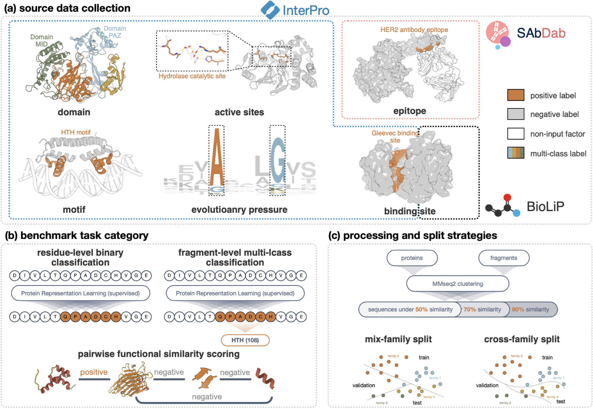
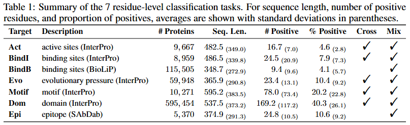
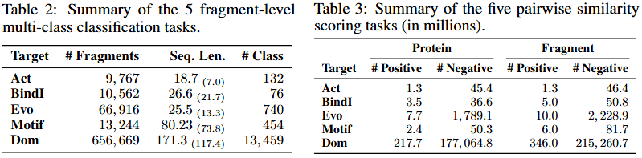

# VENUSX: Unlocking Fine-Grained Functional Understanding of Proteins

## 🚀 Introduction

**VenusX** is a large-scale benchmark for fine-grained protein functional annotation and pairing at residue, fragment, and domain levels. It includes three task categories with six annotation types: residue-level binary classification, fragment-level multi-class classification, and unsupervised local structure pairing for **active sites**, **binding sites**, **conserved sites**, **motifs**, **domains**, and **epitopes**. The benchmark contains over **878,000** samples from InterPro, BioLiP, and SAbDab databases, with mixed-family and cross-family splits at 50%, 70%, and 90% sequence identity thresholds.


## 📑 Results
### Paper Results

VenusX benchmarks fine-grained protein understanding across multiple subprotein levels through three tasks: 

- residue-level binary classification: identifying functionally important residues, 
- fragment-level multi-class classification: classifying fragments by biological role, 
- pairwise functional similarity scoring: matching functionally similar proteins or substructures without requiring explicit function labels.

Benchmarking protein models on VenusX reveals performance gaps between global and fine-grained tasks, highlighting the need for more robust and interpretable models.
### Baselines
<details>
<summary>Table: Summary of baseline models (methods) by input modality</summary>

**Task** indicates evaluation scope:  
- "All" for all three tasks  
- "Sup." for supervised tasks only  
- "Pair" for unsupervised pairwise similarity

| Type              | Model (Method)        | Version        | Task  | # Params | # Train. Params | Embed. Dim | Implementation |
|-------------------|--------------|----------------|-------|----------|------------------|-------------|----------------|
| **Sequence-Only** | ESM2     | t30            | All   | 150M     | 410K             | 640         | [HF: ESM2-t30](https://huggingface.co/facebook/esm2_t30_150M_UR50D) |
|                   |  ESM2            | t33            | All   | 652M     | 1.6M             | 1,280       | [HF: ESM2-t33](https://huggingface.co/facebook/esm2_t33_650M_UR50D) |
|                   |  ESM2        | t36            | Pair  | 3,000M   | --               | 2,560       | [HF: ESM2-t36](https://huggingface.co/facebook/esm2_t36_3B_UR50D) |
|                   | ESM1b        | t33            | Pair  | 652M     | --               | 1,280       | [HF: ESM-1b](https://huggingface.co/facebook/esm1b_t33_650M_UR50S) |
|                   | ProtBert     | uniref         | All   | 420M     | 1.0M             | 1,024       | [HF: ProtBert](https://huggingface.co/Rostlab/prot_bert_bfd) |
|                   | ProtT5       | xl_uniref50    | Pair  | 3,000M   | --               | 1,024       | [HF: ProtT5](https://huggingface.co/Rostlab/prot_t5_xl_uniref50) |
|                   | Ankh         | base           | All   | 450M     | 591K             | 768         | [HF: Ankh](https://huggingface.co/ElnaggarLab/ankh-base) |
|                   | TM-vec       | swiss_large    | Pair  | 3,034M   | --               | 512         | [GitHub: TM-vec](https://github.com/tymor22/tm-vec) |
|                   | ProstT5      | AA2fold        | Pair  | 3,000M   | --               | 1024        | [HF: ProstT5](https://huggingface.co/Rostlab/ProstT5) |
|                   | BLAST        | --             | Pair  | --       | --               | --          | [Conda: BLAST](https://anaconda.org/bioconda/blast) |
| **Sequence-Structure** | SaProt     | 35M_AF2        | All   | 35M      | 231K             | 480         | [HF: SaProt-AF2](https://huggingface.co/westlake-repl/SaProt_35M_AF2) |
|                        | SaProt     | 650M_PDB       | All   | 650M     | 1.6M             | 1,280       | [HF: SaProt-PDB](https://huggingface.co/westlake-repl/SaProt_650M_PDB) |
|                        | ProtSSN        | k20_h512       | All   | 800M     | 1.6M             | 1,280       | [HF: ProtSSN](https://huggingface.co/ai4protein/ProtSSN) |
|                        | ESM-IF1        | --             | Pair  | 148M     | --               | 512         | [HF: ESM-IF1](https://huggingface.co/katielink/esm_if1_gvp4_t16_142M_UR50) |
|                        | MIS-ST         | --             | Pair  | 643M     | --               | 256         | [GitHub: MIF-ST](https://github.com/microsoft/protein-sequence-models) |
|                        | Foldseek       | 3Di-AA         | Pair  | --       | --               | --          | [Conda: Foldseek](https://anaconda.org/bioconda/foldseek) |
| **Structure-Only**     | GVP-GNN        | 3-layers       | Sup.  | 3M       | 3M               | 512         | [GitHub: GVP](https://github.com/drorlab/gvp-pytorch) |
|                        | Foldseek       | 3Di            | Pair  | --       | --               | --          | [Conda: Foldseek](https://anaconda.org/bioconda/foldseek) |
|                        | TM-align       | mean           | Pair  | --       | --               | --          | [Conda: TM-align](https://anaconda.org/bioconda/tmalign) |

</details>

## 🛫 Requirement
### Conda Environment

Please make sure you have installed **[Anaconda3](https://www.anaconda.com/download)** or **[Miniconda3](https://docs.conda.io/projects/miniconda/en/latest/)**.

```bash
git clone https://github.com/AI4Protein/VenusX.git
cd VenusX
```
You can create the required environment using the following two methods.
```bash
conda env create -f environment.yaml
conda activate VenusX
```
or
```bash
conda create -n VenusX python=3.8.18
conda activate VenusX
pip install -r requirements.txt
```
### Hardware

All data processing, baseline experiments were conducted on 16 NVIDIA RTX 4090 GPUs. If you plan to experiment with deep learning models with larger parameters, additional hardware resources may be necessary.

## 🧬 Start with VenuX

### Dataset Information

The dataset for the VenuX Benchmark can be viewed and downloaded at **[Huggingface:AI4Protein](https://huggingface.co/AI4Protein)**. For example: **[AI4Protein/VenusX_Res_Act_MF50](https://huggingface.co/datasets/AI4Protein/VenusX_Res_Act_MF50)** refers to an active site dataset used for identifying functionally important residues. The dataset is clustered based on 50% fragment similarity and divided into training, validation and test sets according to mixed families.





### Train

(1) The `VenusX/script/example/train/train_token_cls.sh` script demonstrates how to train a deep learning model for identifying functionally important residues.

(2) The `VenusX/script/example/train/frag_token_cls.sh` script demonstrates how to train a deep learning model for classifying fragments according to biological roles.

### Compute protein (fragment) embeddings

Folder `VenusX/script/example/embedding` contains scripts for obtaining protein or fragment embeddings using deep learning models and traditional methods. Note: Please set the path of the dataset in the script according to the actual situation.


## 🙌 Citation

If you find this work useful, please consider citing:

```bibtex

```
